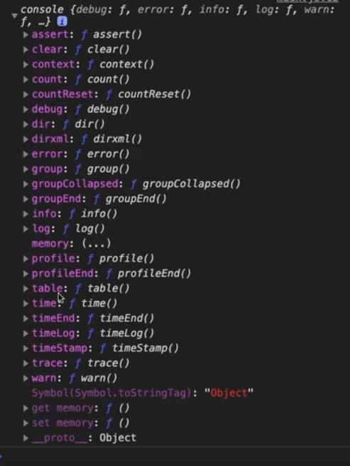
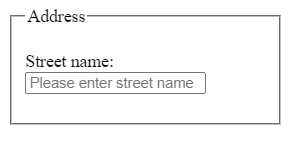
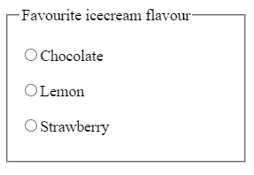
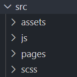
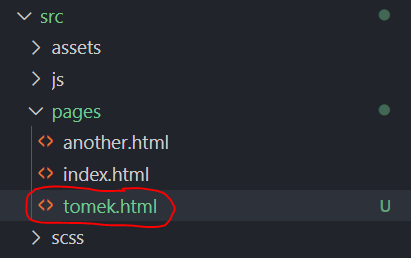
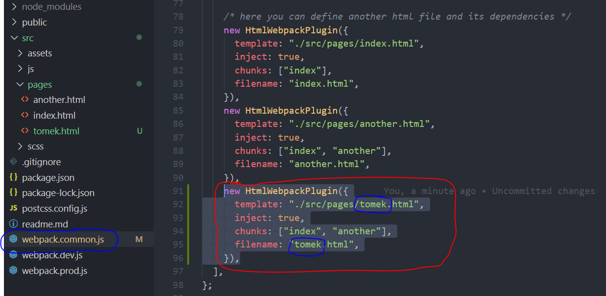
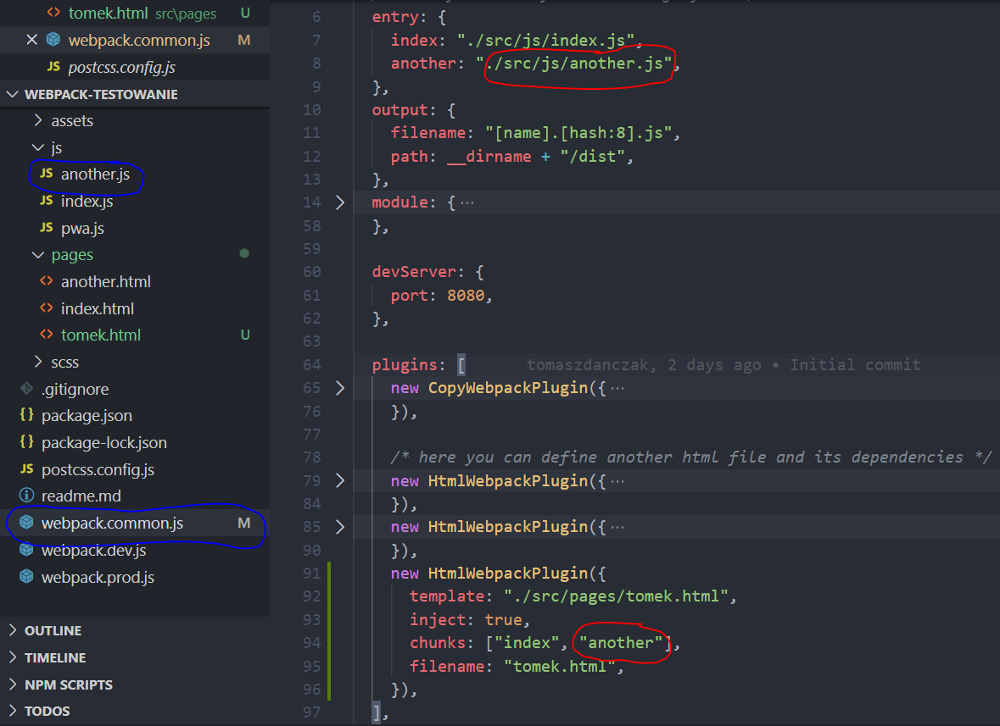
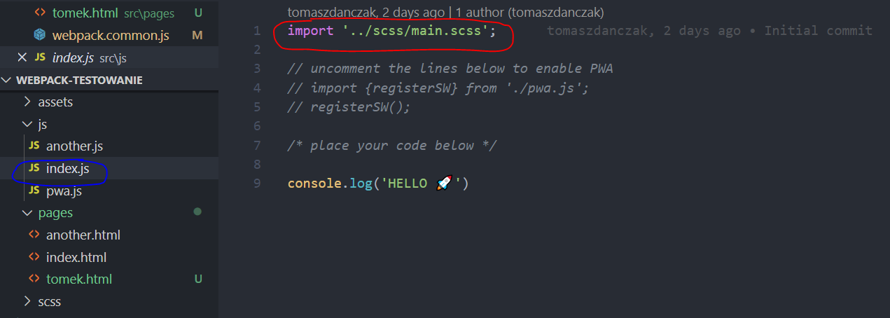

Strona jest do obejrzenia [tutaj](https://tomaszdanczak.github.io/webpack-homepage-test/) 🚀. 
- 👍 Strona jest krótkim info o mnie. 
- 👍 Umieściłem na niej część z moich notatek z najlepszego [kursu frontendu](https://cotenfrontend.pl) na polskim rynku: [WTF Co Ten Frontend](https://cotenfrontend.pl). 
- 👍 Wszystkie moje notatki znajdują się w tym pliku readme.md
- 👍 Napisałem w JS konwerter dodający znacznik, które są później wykorzystywane do kolorowania składni. 


# Tydzień II

### Tagi HTML5
```html
<html lang="pl">  <!-- pamiętać, żeby na polskich stronach wpisywać pl -->
<main>   <!-- w tagu main powinna znajdować się główna treść strony -->
<section>  <!-- każda sekcja powinna posiadać nagłówek -->
<h1>  <!-- nagłówek h1 musi być na stronie (musi być unikalny i w main) -->    
```
### Visual Studio Code
- `View -> Toogle Word Wrap` - załączenie zawijania wierszy
- `Ctrl + Shift + P` - wpisujemy Format Document
### Dokumentacje HTML i CSS
- [Link](https://www.w3.org/TR/html52/) do dokumentacji HTML5
- [Link](https://www.w3.org/TR/CSS/) do dokumentacji CSS
### Inne
- 'WAŻNE' - mówimy arkuszy styl`ów` nie sty`li`
- W celu odświeżenia strony używamy kombinacji klawiszy `Ctrl + R`, ale możemy także użyć klawisza `F5`

# Tydzień III

#### Czym jest trello?
Trello jest prostym narzędziem do organizacji pracy opartym na zasadach Kanban. Trello ułatwia śledzenie postępu prac/nauki. Jest dostępny pod [linkiem](https://trello.com/).
#### Praca z Trello
- jest zalecane trzymanie jednego zadania w doing
- należy dobrze opisywać "definition of done" (DOD)
- zalecane jest używanie trzech zakładek
### Tagi HTML
Poza tagiem `<main>` powinno znajdować się wszystko co się powtarza na stronie np. tagi `<header>` i `<footer>`. Roboty czytają tylko to o jest w tagu `<main>`.
  
Tag `<article>` może zawierać tagi `<header>` oraz `<footer>`.

Tagi `` i `<br>` można zamykać `>` lub `/>`. Obie wersje są poprawne.
### Stylowanie
- używać tylko klas do stylowania elementów, żeby nie mieszać w specyficzności (nie bawimy się w specyficzność)
- `<body>` i `<html>` mogą być bez klasy
- przy stylowaniu starać się nie używać dyrektywy `!important`
- jak w VSC najedzie się kursorem myszki na selektor to pokaże się jego specyficzność
- nazwy klas po angielsku, zgodnie z przeznaczeniem, używamy kebabCase
- w selektorach zawsze jest stylowany ostatni element (poprzednie elementy selektora tylko nakierunkowują)
```css
nav a {
  color: #04ac26;
 }
 ```

Przykład użycia klas:
```html
<header class="header">header<header/>
<main class="main">main<main/>
<footer class="footer">footer<footer/>
```
### Konsola
- `ls -l` - wyświetla zawartość katalogu w formie listy (mamy też dodatkowe informacje jak np. datę ostatniej modyfikacji)
- `cd..` - przenosi do katalogu wyżej (skrót od change directory)
- `mkdir nazwa` - tworzy katalog
- `pwd` - pokazuje całą ścieżkę do katalogu
- `code .` - katalog w którym się znajdujemy uruchamia w VSC
- `cd ../..` - przejście o dwa katalogi w górę
### Różne
- [Google Slides](https://www.google.com/slides/about/) - strona do tworzenia prezentacji
- Shift + strzałki prawo/lewo - zaznacza tekst (przydeja się w momencie jak utworzymy tag za pomocą EMMET i znacznikiem zamykającym chcemy objąć jakiś fragment kodu)
- w DevToolsach w zakładce Network możemy sprawdzić jak pliki są ładowane
- nowe feautery - nowe funkcje / nowe cechy
- '<script src="main.js"><script/> - umieszczamy przed tagiem zamykającym `<body/>`
- 'console.log(`Nazywam się ${name} i mam ${age} lat`); - template stringi mogą być łamene - łamania sią odzwierciedlane w konsoli
- w tagu to samo słowo może być nazwą klasy i id: `<section class="features" id="features"><section/>`

# Tydzień IV
### Stylowanie
- dzięki `display: inline-block`, możemy nadać margines dolny i górny na element liniowy (np. strong)
- `min-height: 100vh` - nadaje elementowy wysokość conajmniej równą wysokości okna przeglądarki
- gdy element dostanie `position: fixed`, to jego szerokość jest "zjadana" (tak jakby był inline-block), trzeba dać mu 100 % szerokości , żeby nic się nie zmieniło. Pamiętać o tym, gdy zmieniamy `<nav>` na fixed (gdy robimy przyklejoną nawigację)
- `position: sticky;` - podobny do fixed, ale element przykleja się do góry strony dopiero jak o nią uderzy (wcześniej normalnie się przewija). Jeszcze nie wszędzie wspierana
- `line-height` - używać, żeby poprawić czytelność wierszy
- sposób na responsywny obrazek:
  ```css
     .image {
          width: 100%;
          max-width: 100px;
          display: block;
     
     }
  ```
 - **floaty** używamy tylko do opływania np. obrazków 
    + gdy jest problem z wychodzeniem elementu opływanego to dać `overflow=hidden`
    + gdy jest problem z podchodzeniem treści do góry to dać `clear: both`
### Przewijanie na górę strony
```html
<header id="top">
  .
  .
  .
<footer>
  <a href="#top" class="top">na górę<a/>
<footer/>
```
```css
  .top {
    position: fixed;
    bottom: 10px;
    left: 10px;
  }
```
### Różne
- używać `block__element--js` dla elementów z którymi robimy coś w js
- nie uczyć się na zapas
- jeżeli przez półgodziny nie umie się czegość zrobić to pytać
- jeżeli jest problem z projektem, to rozpisać go na jaknajmniejsze kawałkii próbować je rozwiązać (z rozwiązanych kawałków skłądać całe rozwiązanie)
- jeżeli nie ma się pomysłu na projekt to znaleźć jakąś organizację pozarządową w mieście i im zrobić oraz rozwijać stronę
- gitlens - rozszerzenie do VSC
- `Ctrl + Alt + F` - zamiana tekstu w VSC - używać jeżeli chcemy np. dodać tę samą klasę do wszystkich akapitów
- `Ctrl + C` - kasuje ostatnie polecenie bez jego wykonywania (w konsoli)

# Tydzień V
### JavaScript
- operator warunkowy
  ```javascript
     (zmienna1 > zmienna2) ? console.log('true'):console.log('false');
     //-----------------------------
     const amIOld = (age > 70) ? "yes":"no";
     
     console.log(amIOld);
  ```
- funkcja strzałkowa
  ```javascript
    const calculateFat = (x) => {
    
    {
    //-----------------------------
    const calculateFat = x => {
    
    {
  ```
- funkcja podmieniająca kontent w elemencie (przyjmuje referencje do elementu i nowy kontent)
  ```javascript
    function createContent(querySelectorContent, content) {
    const element = document.querySelector(querySelectorContent);
    element.innerHTML = content;
    }
    
    createContent('.week-summary__description--js", "Witaj Świecie");
  ```
- zwykła deklaracja funkcji i arrow function
  ```javascript
    function greetOld(age, firstName) {
      console.log(
        `Witaj Drogi Odwiedzający, nazywam się $(firstName) i mam $(age) lata.`
        );
    }
    // Arrow Function
    const greet = (age, firstName) => {
      console.log(
        `Witaj Drogi Odwiedzający, nazywam się $(firstName) i mam $(age) lata.`
        );
    }
  ```
### JavaScript - obiekty
- Obiekt z właściwościami prostymi, metodami   obiektem zagnieżdżonym
```javascript
  const deathStar = {
    diameter: 120000,
    fire: (target) => {
      console.log('${target} destroy`}
    },
    isOperating: true,
    name: "Death Star",
    levels: 357,
    population: 1000,
    isLightOn: true,
    commander: {
      name: "Darth Vader",
      age: 44
    }
  }
```
+ odwołanie się do właściwości obiektu
```javascript
  console.log(deathStar.name)
```
+ wywołanie metody z parametrami
```javascript
  deathStar.fire('Rebel ship');
```
+ odwołanie się do właściwości zagnieżdżonego obiektu (notacja dot)
 ```javascript
  console.log(deathStar.commander.name)
```
+ odwołanie się do właściwości obiektu (notacja bracket)
 ```javascript
  const myProperty = name;
  
  console.log(deathStar[myProperty])
```
+ przypadek, kiedy jest konieczne użycie notacji bracket a dot by się nie sprawdziło:
+ odwołanie się do właściwości zagnieżdżonego obiektu (notacja dot)
 ```javascript
  const showMeProperty = (myProperty) => {
    console.log(deathStar[myProperty]);
  }
  
  showMeProperty('levels')
```

### Stylowanie
- Tabelą dobrze jest nadać szerokość 100% (domyślnie się nie rozszerzają)
### Różne
- przy goooglowaniu rzeczy najlepiej zaznaczyć zakres do roku wstecz (we frontendzie wiedza szybko się dezaktualizuje)
- używać normalize.css oraz
```css
  *,
  *::after,
  *::before {
    margin: 0;
    padding: 0;
    box-sizing: inherit;
  }

  html {
    // This defines what 1rem is
    font-size: 62.5%; //1rem = 10px; 10px/16px = 62.5%
  }

  body {
    box-sizing: border-box;
    }
  }
```
- wywołanie `console.log(console)` wyświetli w konsoli wszystkie metody i właściwości

  
  
- sprawdzenie, które rzeczy są pobierane z cache (można wyłączyć cache - `disable cache`). `Ctrl + F5` - twarde odświeżenie (wszystko pobiera na nowo)

  
  
- gdy utknie się z kodem, porozmawiać z kaczuszką :)

  

# Tydzień 6

### JavaScript

- #### Switch
```javascript
const myNumber = {name: 'maciek'};

switch(myNumber) {
  case 7: 
    console.log('jestem siódemką');
    break;
  case 9:
    console.log('jestem dziewiątką');
    break;
  default:
    console.log('jestem czymś innym');
}
```
- #### Operator warunkowy zamiast if else
```javascript
  if(32 > 30) {
    console.log("to prawda");
  } else {
    console.log("to nieprawda");
  }
  
  (32 > 30) ? console.log("to prawda") : console.log("to nieprawda");
  
  const result = (32 > 30) ? console.log("to prawda") : console.log("to nieprawda");
```
### Formularze
- #### Formularze: form, input, label
    + według specyfikacji tagi label i input powinny być zamknięte
    ```html
      <p>
        <label for="firstName">Your name:<label/>
        <input id="firstName" name="firstName">
      <p/>
    ```
    + można opakować input w label, albo można nie używać opakowania i użyć atrybutu for (lepsze to pierwsze rozwiązaniem bo łatwiej stylować)
  ```html
    <main>
      <h1>Forms playground<h1/>
      <form>
        <p>
          <label for="firstName">Your name:</label>
          <input id="firstName" name="firstName">
        <p/>
        <p>
          <label>Your last name:
            <input id="lastName" name="lastName">
          </label>
        <p/>
      <form/>
    <main/>
  ```
    + `value` - domyślna uzupełniona wartość inputa, `placeholder` - tekst podpowiedzi
    ```html
      <p>
        <label for="firstName">Your name:<label/>
        <input type="text" value="Maciek" placeholder="Wpisz swoje imię" id="firstName" name="firstName">
      <p/>
    ```
    + stylowanie formularzy według BEM
    ```html
      <form class="form">
        <label for="firstName">Your name:<label/>
        <input class="form__input" type="text" value="Maciek" placeholder="Wpisz swoje imię" id="firstName" name="firstName">
      <form/>
    ```
    ```css
      .form {

      }

      &__input {
        display: block;
        width: 100%;
      }
    ```
- #### Formularze: fieldset, radio, checkbox
   - Element `fieldset` grupuje kontrolki o podobnym przeznaczeniu. Element `legend` zawiera objaśnienie przeznaczenia grupy kontrolek.
   ```html
    <fieldset>
      <legend>Address</legend>
      
      <p>
        <label>Street name:
          <input
             class="form__item"
             id="streetName"
             placeholder="Please enter street name"
             name="streetName"
             />
        </label>
      </p>  
    </fieldset>
    ```
    
    
    - Element `radio` pozwala wybierać jeden element z grupy możliwych opcji

      ```html
        <fieldset>
          <legend>Favourite icecream flavour</legend>
          <p>
              <label><input name="iceCream" type="radio" value="chocolate">Chocolate</label?
          </p>
          <p>
              <label><input name="iceCream" type="radio" value="lemon">Lemon</label?
          </p>
          <p>
              <label><input name="iceCream" type="radio" value="strawberry">Strawberry</label?
          </p>
        </fieldset>
      ```
    
 #### Formularze: number, range, tel, email, password 
 -  Range - element będący graficznym interfejsem do wprowadzania danych
    ```html
      <input type="range" min="0" max="100" step="5">
    ```
    Sposób na podejrzenie wartości range:
    ```html
      <input
        class="form__item range--js"
        id="range"
        name="range"
        type="range"
        min="0"
        max="100"
        step="20"
      />
    ```
    ```javascript
    const myRange = document.querySelector('.range--js');
    
    myRange.value;
    ```
      
 ### CSS Grid
 
 #### Definiowanie siatki (właściwośi rodzica)
 - `grid-template-columns` - definiuje ilość i rozmiar kolumn
 - `grid-template-rows` - definiuje ilość i rozmiar wierszy
 - `grid-gap` - definiuje odstępy
 #### Funkcje przydatne przy definiowaniu siatki
 - `repeat()`
 - `minmax()`
 - `1fr`
 #### Rozmieszczenie elementów w siatce (pierwszy sposób)
  ```css
    .main {
      display: grid;
      grid-template-areas: "header header"
                           "article aside"
                           "footer footer";
    }
    
    .header {
      grid-area: header;
    }
  ```
  #### Rozmieszczenie elementów w siatce (drugi sposób)

  ```css
    .header {
      background: hotpink;
      grid-column-start: 2;
      grid-column-end: 4;
      grid-row-start: 1;
      grid-row-end: 3;
    }
  ```
  
 ### Media Queries
   - Mediaqueries muszą być definiowane po podstawowych stylach (mediaqueries nie zwiększają specyficzności)
    
      ```css
        @media screen and (max-width: 600px) {
          body {

          }
        }
      ```
      
   - Chowanie elementu
      ```css
        @media screen and (min-width: 768px) {
          .mobile {
            display: none;
          }
        }
      ```
 ### Eventy
 
  - Elementowi z którym chcemy pracować w JavaScripcie dodać klasę z modyfikatorem `--js`
    ```html
      <button class="action--js">Zmień nagłówek</button>
    ```
  - Pobranie referencji do elementu, wywołane funkcji po zdarzeniu click
    ```javascript
      const myClick = () => {
        console.log('kliknąłeś');
      }
      
      const button = documen.querySelector(".action--js");
      
      button.addEventListener('click', myClick);
    ```
  - Odniesienie się do klikniętego elementu
      ```javascript
      button.addEventListener('click', e=> {
        console.log(e.target);
      });
      ```
### Hamburger menu
### Różne
 - Domyślne style elementów są zależne od systemowych (ikonki są upodobnione do systemowych)
 - Można domyślnie zaznczyć element formularza, poprzez dodanie atrybutu `checked`. Atrybut może mieć wartość (`checked=checked`), ale nie musi
 - `display: block` na label spowoduje, że labele będą nad elementami, które opisują
 - Atrybut `required` nakazuje przeglądarce przeprowadzenie walidacji formularza
 - CSS Grid najlepiej się sprawdza do budowania całych layoutów
 - Flexbox sprawdza się dobrze do pozycjonowania, centrowania elementów wewnątrz innych elementów. Nie używać flexboxa do budowania całych layoutów.
 - `button` - powinien być używany do interakcji na stronie
 - `a` - powinien być używany do nawigacji

# Tydzień VII
 ### Node
 #### Pierwsze kroki
 - Uruchomienie skryptu w node. Należy wejść w konsoli w katalog ze skryptem, a następnie uruchomić
   ```console
    node skrypt.js
   ```
 - Tworzenie pliku package.json. Należy w konsoli wpisać (opcja -y domyślnie uzupełnia)
    ```console
    npm init -y
   ```
    co utworzy
    ```console
     {
      "name": "playground",
      "version": "1.0.0",
      "descripton": "",
      "main": "script.js",
      "scripts": "echo \"Error: no test specified\" &&
     }
    ```
  - Dodanie paczki do projektu
    ```console
     npm install <nazwa_paczki> --save
     npm install <nazwa_paczki> --save-dev
     
     npm install --save normalize.css
    ```
  - Odtworzenie katalogu node_modules
    ```console
      npm install
    ```
### Praca z node-sass
1. Instalacja pakietu
    ```console
    npm install node-sass
    ```
1. Zamiana scss na css
    ```console
    npx node-sass main.scss main.css
    ```
1. Dodanie automatyzacji (śledzenie zmian w plikach scss)
    ```console
    npx node-sass -w main.scss main.css
    ```
1. Dodanie skryptu

1. Wywołanie skryptu
    ```console
    npm run sass
    ```
1. Zmodyfikowanie skryptu (organizacja plików scss i css w katalogach)
    ```console
    "scripts": {
      "sass": "npx node-sass -w scss/msin.scss main.css",
      "test": "echo\"Error: no test specified\" && exit1"
      },
    }
    ```
### Różne
- plik `.gitignore` zawiera nazwy ignorowanych plików i katalogów (np. node_modules)
   
 ```html
    <main>main</main>
    <main class="main">main</main>
```

# Tydzień VIII

### Import CSS/SCSS
#### SCSS
```scss
@import "abstracts/variables";
```
#### CDN
```scss
@import "https://cdnjs.cloudflare.com/ajax/libs/normalize/8.0.1/normalize.min.css";
```
### Import / Export JS
Są dwie najpopularniejsze koncepcje modułów: CommonJS oraz ES6 Modules

#### ES6 Modules (proste użycie)
- HTML:
	```html
	<script src="main.js" type="module"></script>
	```
- JS Export (hello.js)
	```javascript
	export const hello = name => {
	    return `Cześć ${name}`;
	}
	```
- JS Import (main.js)
	```javascript
	import {hello} from './hello.js';

	console.log(hello('Tomek'));
	```
#### ES6 Modules (export domyślny)
Export domyślny pozwala na dowolne nazywanie rzeczy które importujemy. Nazwy importu nie podajemy w nawiasach sześciennych. Dzięki exportowi domyślnemu nie musimy się martwić o konflikty w nazwach. 

- Export (tomek.js)
	```javascript
	const tomek = {
	    name: 'Tomek',
	    age: 20
	}
	export default tomek;
	```
- Import (main.js)
	```javascript
	import human from './tomek.js';

	console.log(human);
	```

### WTF Webpack StarterKit - pierwsze uruchomienie

#### Workflow
- Tworzymy Repozytorium na GitHubie: [StarterKit](https://github.com/maciejkorsan/wtf-webpack-starter/generate)
- Klunujemy repozytorium na dysk (uruchamiamy komemndę klonowania będąc w katalogu dev) (git clone adres_do_repozytorium)
- Wchodzimy do katalogu z repozytorium (cd nazwa_repozytorium)
- Instalujemy zależności (npm install)
- Kroki wykonywane też przy każdym kolejnym uruchomieniu 
	- Uruchamiamy edytor (code .)
	- Uruchamiamy Server Webpack (npm run start)
	- Strona dostępna pod adresem: http://localhost:8080/

#### Budowa Webpacka
- W katalogu src znajdują się pliki na których pracujemy:

  
  
	- assets
	- js
	- pages (w którym znajduje się index.html). W pliku index.html nie ma znacznika link do stylów oraz script do stylów. Ścieżki podajemy względem plików źródłowych a nie serwerowych.
	- scss
- W pliku package.json mamy skonfigurowane trzy skrypty:
	- start (uruchamia serwer w trybie developerskim)
	- build (tworzy katalog wynikowy)
	- publish
### WTF Webpack StarterKit – dodawanie nowych plików, sourcemapy

#### Dodawanie pliku HTML:

- Dodawanie pliku do katalogu pages: 

  
  
- Dodanie wpisu do pliku webpack.common.js. Tworzenie nowej instancji wtryczki do HTML. Po dodaniu wpisu trzeba zrestartować serwer. 

	

#### Dodawanie pliku JS:
- Plik tworzymy w katalogu src/js. 

  

- Dodajemy wpis do tablicy (patrz wyżej)

#### Dodawanie styli
- Import styli w pliku index.js 

	
- normalize możemy zainstalować przez npm i zaimportować w pliku ze stylami w następujący sposób:

	```css
	@import "~normalize.css";
	```

### WTF Webpack StarterKit - budowanie projektu i publikacja
- budowanie projektu (utworzenie katalogu dist). Zawartość katalogu dist publikujemy na serwerze.
```console
npm run build
```
- wszystko co znajduje się w katalogu public jest kopiowane bezpośrednio do katalogu dist
- opublikowanie strony na GitHubie za pomocą gh-pages (*tworzy noby branch gh-pages*)
```console
npm run deploy
```
### Custom Properties (zmienne CSS)
#### Definiowanie zmiennych	
```css
:root {
  --small-padding: 8px;
}
```
#### Użycie wartości zmiennej
```css
h1 {
  padding: var(--small-padding);
}
```

# Tydzień IX

### Użycie biblioteki moment w projekcie (homework)

#### Instalacja i przykład użycia
- instalacja biblioteki

	```console
	npm install moment
	```
- import biblioteki w pliku JS
	```javascript
	import moment from 'moment';
	```
- Użycie jakiejś funkcji z bibioteki

	```javascript
	console.log(moment().startOf('day').fromNow());
	```
- [Link](https://momentjs.com/) do dokumentacji biblioteki Moment JS

#### Wstrzyknięcie rezultatu uzyskanego z Moment JS do HTML

HTML:

```html
<p>Od początku dnia minęło:<span class="time--js"></span></p>
```

JS:
```javascript
const timePlaceholder = document.querySelector('.time--js');

timePlaceholder.innerHTML = moment().startOf('day').fromNow();
```

### Dark Mode (homework)

- przykładowa strona z buttonem zmieniającym tryb

	```html
	<main>
	  <h1>Cześć</h1>
	  <p>Lorem ipsum dolor sit amet consectetur, adipisicing elit. Aliquid totam eos, ab sed accusamus laborum facilis neque nihil distinctio officiis dolore nostrum quidem magni laudantium enim repellat nemo praesentium saepe.</p>
	  <button class="mode--js">Zmień tryb</button>
	</main>
	```

- definicja Custom Properties (zmiennych CSS) i przypisanie ich do tła strony i koloru tekstu
	```css
	:root {
	  --background-color: #fefefe;
	  --text-color: #333333;
	}

	body {
	  background: var(--background-color);
	  color: var(--text-color);
	}
	```
- logika Java Script:
	```javascript
	let isDark = false;

	const switchModes = document.querySelector('.mode--js');

	switchModes.addEventListener('click', ()=>{
	  if(isDark) {
	    document.documentElement.style.setProperty('--background-color', '#fefefe');
	    document.documentElement.style.setProperty('--text-color', '#333333');

	    isDark = false;
	  } else {
	    document.documentElement.style.setProperty('--background-color', '#333333');
	    document.documentElement.style.setProperty('--text-color', '#fefefe');

	    isDark = true;
	  }
	})
	```
### Google fonts
- należy wybrać Latin Extended i wpisać zażółć gęślą jaźń żeby łatwo było można odfiltrować tylko te fonty które posiadają wszystkie polskie diakrytyczne znaki

- czcionkę dołączamy do projektu za pomocą import albo link:

	```html
	<style>
	@import url('https://fonts.googleapis.com/css2?family=Lato:ital,wght@0,100;0,400;1,700&display=swap');
	</style>

	<link href="https://fonts.googleapis.com/css2?family=Lato:ital,wght@0,100;0,400;1,700&display=swap" rel="stylesheet">
	```
- użycie czcionki:

	```css
	font-family: 'Lato', sans-serif;
	```
### GIT: branche

- wypisanie gałęzi:
	```console
	git branch
	```
- utworzenie gałęzi:
	```console
	git branch nazwa_gałęzi
	```
- przejście na gałąź:
	```console
	git branch nazwa_gałęzi
	```
- utworzenie gałęzi od razu z przejściem na nią:
	```console
	git branch -b nazwa_gałęzi
	```
- wypchnięcie brancha na GitHuba (użyć git push i skopiować podpowiedź)
	```console
	git push
	git push --set-upstream origin nazwa_brancha
	```
- mergowanie do mastera (trzeba przejść na master)
	```console
	git checkout master
	git branch -b nazwa_gałęzi
	```
- usunięcie gałęzi:
	```console
	git branch -d nazwa_gałęzi
	```

### MARKDOWN
- dodanie odnośnika
	```console
	[nazwa](adres)
	```
- dodanie grafik. W projekcie założyć katalog gh i w nim umieszczać grafiki używane w README.md
	```console
	
	```
Kwafratowe przed okrągłymi. K przed O. KO
- `Wyróżnienie fragmentu tekstu`
	```console
	`tekst`
	```
- *pochylenie tekstu*
	```console
	*tekst*
	```
- **pogrubienie tekstu**
	```console
	**tekst**
	```
- ***pochylenie i pogrubienie tekstu***
	```console
	***tekst***
	```
- żeby zobaczyć podgląd zmian w README.md na GitHubie należy kliknąć zakładkę Preview changes

### JS: Tablice
#### Dodawanie / usuwanie elementów do/z tablicy
- dodanie elementu na końcu
	```javascript
	myArray.push()
	```
- usunięcie elementu z końca
	```javascript
	myArray.pop()
	```
- dodanie elementu na początku
	```javascript
	myArray.unshift()
	```
- usnięcie elementu z końca
	```javascript
	myArray.shift()
	```
- szukanie indeksu elementu
	```javascript
	myArray.indexOf('elem');
	```
- sprawdzanie czy element występuje w tablicy (uważać bo index 0 jest konwertowany na false, a element nieznaleziony -1 na true):
	```javascript
	if(myArray.indexOf('tekst')>=0) {
	  console.log('mam ten element');
	} else {
	  console.log('nie mam elementu :(')
	}
	```
Dwie metody łatwe do pomylenia. Nazwy różnią się tylko małą literą p.

- usuwanie elementów od danej pozycji (metoda działa na indeksie i zakresie). Metoda `zwraca i usuwa !!!` elementy.
	```javascript
	myArray.splice(1,2)
	```
- pobranie n elementów od danej pozycji (metoda działa na indeksach). Metoda tylko `zwraca !!!` elementy.
	```javascript
	const newArray = myArray.slice(2,4)
	```
	
#### Stringi
Stringi zachowują się bardzo podobnie do tablic 
```javascript
const myString = 'Tomek';

console.log(myString[5]);
console.log(myString.length);
```


### JS: Pętle

#### FOR

Warunkien najczęściej jest wyrażenie ze znakiem mniejszości (mniejsze od jakiejś długości)

```javascript
for(let i = 0; i < 3; i++) {
  console.log('i` +  `wykoananie pętli');
}
```

#### Pętla FOR i tablice

```javascript
const myArray = ['apple','peach', 'plum'];

for(let i = 0; i < myArray.length; i ++) {
 console.log('Pod indeksem ' + i + 'jest element ' + myArray[i])
}
```

#### WHILE

```javascript
let myNumber = 0;

while(myNumber < 10) {
  console.log('hello');
  
  myNumber++;
}
```
#### DO WHILE

```javascript
let n = 9;

do {
  console.log(n);
  n = n + 3;
} while(n < 9);

console.log(n);
```

#### FOR IN (własność in obiekt)

```javascript
const tomek = {
  name: 'tomek',
  age: 20
}

for( let myProperty in tomek) {
  console.log(myProperty);
  console.log(tomek[myProperty]);
}
```

#### FOR OF (element of tablica)

```javascript
const myArray = ['a', 'b', 'c'];

for(let element of myArray) {
  console.log(element);
}
```

### JS: Przechowywanie danych

Wartości Cookies, Local Storage i Session Storage możemy podejrzeć w zakładce Applicatin (devtools -> Application):
(screen)

#### Cookie (są już przestarzałe)

- wyświetlenie ciasteczek
	```javascript
	  console.log(document.cookie);
	```
- ustawienie ciasteczek
	```javascript
	document.cookie = 'name = tomek';
	```
#### Local Storage (żyje do ręcznego wyczyszczenia)

- ustawienei wartości
	```javascript
	localStorage.setItem('human', 'tomek');
	```
- pogranie wartości
	```javascript
	console.log(localStorage.getItem('human'));
	```
- usunięcie wpisu
	```javascript
	localStorage.removeItem('human');
	```
- zapisanie w Local Storage obiektu
	```javascript
	localStorage.setItem('nowyKlucz', JSON.stringify({name: 'tomek'}));
	```
- odczytanie JSON
	```javascript
	const myResult = localStorage.getItem('nowyKlucz');
	
	const myNewObject = JSON.parse(myResult));
	
	myNewObject.newProperty = 'hi';
	
	
	```
#### Session Storage (żyje do zamknięcia zakładki przeglądarki)

Session Storage używamy tak samo jak Local Storege. W wywoładniu używamy sessionStorage.

#### Podstawowy Flow aplikacji korzystającej z Local Storage
HTML
```html
<input class="entry--js">
<button class="action--js">Zapisz</button>
```

JS
```javascript
const entry = localStorage.getItem('entry');
let result = '';

if (entry) {
result = entry;
}

const entryInput = document.querySelector('.entry--js')
entryInput.value = result;

const button = document.querySelector('.action--js')

button.addEventListener('click', ()=> {
localStorage.setItem('entry', entryInput.value)
})

```

# Tydzień X
 ### SVG
 #### Dodawanie svg
 - grafikę w formacie svg możemy dodać do strony za pomocą znacznika :
   ```html
    
   ```
  - możemy ją także dodać za pomocą znacznika <svg>:
    ```html
    <svg width="100" height="100">
	   <circle cx="50" cy="50" r="40" stroke="green" stroke-width="4" fill="yellow" />
	   Sorry, your browser does not support inline SVG.
    </svg>
    ```
  #### Dodawanie stylowanie dzięki dodaniu klasy
  Dzięki dodaniu grafiki svg znacznikiem svg można dodać klasę do elementów i stylować jak inne elementy html 
  ```html
    <svg width="100" height="100">
      <circle class="element" cx="50" cy="50" r="40" stroke="green" stroke-width="4" fill="yellow" />
      Sorry, your browser does not support inline SVG.
    </svg>
   ```
	
   ```css
	.element {
  		opacity: .5;
  		transition: opacity .3s ease-in;
	}

	.element:hover {
  		opacity: 1;
	}
   ```
#### Animacja grafiki SVG
```css
@keyframes show {
  from {
    opacity: .3;
  }
  to {
    opacity: 1;
  }
}

.animate {
  animation: show .5s ease-in infinite alternate;
}		
```
```html
<svg width="100" height="100">
   <circle class="animate" cx="50" cy="50" r="40" stroke="green" stroke-width="4" fill="yellow" />
   Sorry, your browser does not support inline SVG.
</svg>
```
### Head & OpenGraph
- Brak pozwolenia na powiększanie strony
```html
<meta name="viewport" content="width=device-width, initial-scale=1.0" />
```
- własność description
```html
  <meta name="description" content="My og description of my website">
```
- Open Graph - protokuł opisujący stronę za pomocą tagów meta
```html
   <!-- Title -->
   <meta property="og:title" content="My og title" />
   <!-- OPTIONAL description. 2-4 sentences. -->
   <meta property="og:description" content="My og description of my website" />
   <!-- full url with http(s) ie. https://tomaszdanczak.github.io/webpack-homepage-test/ -->
   <meta property="og:url" content="https://tomaszdanczak.github.io/webpack-homepage-test/" />
   <!-- full url to the image with http(s) ie. https. Facebook suggests at least 1200 x 630. -->
   <meta property="og:image" content="" />
```
#### Różne
- plik favicon.ico umieszczamy w głównym katalogu. Nie trzeba definiować w kodzie odwołania do niego..
- przydatna strona do tworzenia grafik: [www.canva.com](www.canva.com)
- sprawdzanie opisów OG: [www.debug.iframely.com](www.debug.iframely.com)
### WAI, WCAG, A11y, ARIA
- WCAG [https://www.w3.org/WAI/WCAG21/quickref](https://www.w3.org/WAI/WCAG21/quickref)
- A11y [https://www.a11yproject.com](https://www.a11yproject.com)
- Widzialni [https://www.widzialni.pl](https://www.widzialni.pl)

Tworzenie stron (kilka rad odnośnie dostępności)
- Pisz semantycznie
- Trzymamy kontrast
- Dobrze dobieramy kolory
- Unikamy autoplay
- Nie ograniczaj rzeczy czasowo
- Nie usuwaj :focus
- Używaj alt (i kończ opisy kropką!)
- ARIA - dodaje np. opisy pól formularzy, gdy nie mamy label (własność pomaga, gdy korzystamy z aplikacji wspomagających)
### PWA
Należy dołożyć dwa pliki
- manifest.json

### Hydrapp
#### Hydrapp - workflow
1. sds
2. fdfd

# Tydzień XI
### JS: destrukturyzacja i spread operator
#### Destrukturyzacja
- Destrukturyzacja obiektu:
	```javascript
	const person = {name: 'tomek', age: 20}

	console.log(person.name)

	const {name, age} = person; 

	console.log(name);

	person.name = "kamil";

	console.log(name);   // tomek
	console.log(person.name);   // kamil
	```
- Destrukturyzacja tablicy:
	```javascript
	const food =['apple','kiwi','orange'];

	console.log(food);

	const [first, second] = food;

	console.log(first);
	```
#### Spread operator
- Spreaad operator na obiektach (operator "rozsmarowuje" obiekt):
	```javascript
	const person = {
	  name: 'tomek',
	  age: 20
	}

	const address = {
	  city: 'Łowicz',
	  country: 'Poland'
	}

	console.log(person);
	console.log(address);

	const personWithAddress = {
	  ...person,
	  ...address
	}

	console.log(personWithAddress);
	```
- Spread operator na tablicach:
	```javascript
	const fruits = ['apple','kiwi','orange'];
	const drinks = ['water','juice','beer'];

	console.log(fruits);
	console.log(drinks);

	const fruidsAndDrinks = ["banana", ...fruits, "plum", ...drinks, "milk"];
	console.log(fruidsAndDrinks);
	```
### API - POSTMAN

Link do pobrania [POSTMANA](https://www.postman.com/downloads/).

#### Użycie API Githuba
- Dostęp do API:
- Wyświetlenie publicznych repozytoriów użytkownika:
- Użycie zapytania w POSTMAN
- Dodanie parametrów do zapytania:

### JS: Fetch API

#### PROMISE - szablon (console.log może się wywołać przed promisem, działa asynhronicznie)
```javascript
something()
  .then((response)=> {
  // do something
  }).catch((error)=> {
  // 
  })
  
console.log("test")

```
	
#### FETCH - szablon	
```javascript
fetch("https://api.github.com/users/tomaszdanczak/repos")
.then(resp => resp.json())
.then(resp => {
  // w resp mamy jsona z odpowiedzią
  console.log(resp);
})
.catch(error => {
  console.log(error)
})

```

#### Praktyczne użycie FETCH

Javascript:
```javascript
fetch("https://api.github.com/users/tomaszdanczak/repos")
.then(resp => resp.json())
.then(resp => {
  // w resp mamy jsona z odpowiedzią
  for (let repo of resp) {
    const {name, html_url} = repo;
    const repositoryList = document.querySelector('.list--js');
    const myTemplate = `<li>
${name} <a href="${html_url}" title="link do repozytorium ${name} na githubie">link do githuba</a>
</li>`;
    repositoryList.innerHTML += myTemplate;
    }
})
.catch(error => {
  console.log('nie udało się pobrać');
})
```

Html:
```html
<main>
  <h1>Moje repozytoria</h1>
  <ul class="list--js">
    
  </ul>
</main>
```

# Tydzień XII
### Multimedia
#### Audio:
```html
<audio src="https://file-examples.com/wp-content/uploads/2017/11/file_example_MP3_700KB.mp3" controls></audio>
```
#### Video (używać MP4)
```html
<video src="https://download.blender.org/peach/bigbuckbunny_movies/BigBuckBunny_320x180.mp4" controls></video>
```

#### Sterowanie audio i video za pomocą JavaScriptu (simple player):
HTML:
```html
<video  class="video video--js" src="https://download.blender.org/peach/bigbuckbunny_movies/BigBuckBunny_320x180.mp4" controls></video>
  
<button class="play play--js">play</button>
<button class="pause pause--js">pause</button>
<button class="stop stop--js">stop</button>
```
JavaScript:
```javascript
const video = document.querySelector(".video--js");
const playButton = document.querySelector(".play--js");
const pauseButton = document.querySelector(".pause--js");
const stopButton = document.querySelector(".stop--js");

playButton.addEventListener("click", e=>{
  video.play();
})

pauseButton.addEventListener("click", e=>{
  video.pause();
})

stopButton.addEventListener("click", e=>{
  video.pause();
  video.currentTime = 0;
})
```
#### Youtube
```html
<iframe width="560" height="315" src="https://www.youtube.com/embed/oWHaDSeIY7M" frameborder="0" allow="accelerometer; autoplay; encrypted-media; gyroscope; picture-in-picture" allowfullscreen></iframe>
```

### Frameworki CSS
#### [Bootstrap](https://getbootstrap.com/)
- [Grid Example](https://getbootstrap.com/docs/4.5/examples/grid/#containers)
- [Forms](https://getbootstrap.com/docs/4.5/components/forms/)
- Starter template:
	```html
	<!doctype html>
	<html lang="en">
	  <head>
	    <!-- Required meta tags -->
	    <meta charset="utf-8">
	    <meta name="viewport" content="width=device-width, initial-scale=1, shrink-to-fit=no">

	    <!-- Bootstrap CSS -->
	    <link rel="stylesheet" href="https://stackpath.bootstrapcdn.com/bootstrap/4.5.0/css/bootstrap.min.css" integrity="sha384-9aIt2nRpC12Uk9gS9baDl411NQApFmC26EwAOH8WgZl5MYYxFfc+NcPb1dKGj7Sk" crossorigin="anonymous">

	    <title>Hello, world!</title>
	  </head>
	  <body>
	    <h1>Hello, world!</h1>

	    <!-- Optional JavaScript -->
	    <!-- jQuery first, then Popper.js, then Bootstrap JS -->
	    <script src="https://code.jquery.com/jquery-3.5.1.slim.min.js" integrity="sha384-DfXdz2htPH0lsSSs5nCTpuj/zy4C+OGpamoFVy38MVBnE+IbbVYUew+OrCXaRkfj" crossorigin="anonymous"></script>
	    <script src="https://cdn.jsdelivr.net/npm/popper.js@1.16.0/dist/umd/popper.min.js" integrity="sha384-Q6E9RHvbIyZFJoft+2mJbHaEWldlvI9IOYy5n3zV9zzTtmI3UksdQRVvoxMfooAo" crossorigin="anonymous"></script>
	    <script src="https://stackpath.bootstrapcdn.com/bootstrap/4.5.0/js/bootstrap.min.js" integrity="sha384-OgVRvuATP1z7JjHLkuOU7Xw704+h835Lr+6QL9UvYjZE3Ipu6Tp75j7Bh/kR0JKI" crossorigin="anonymous"></script>
	  </body>
	</html>
	```
#### [tailwindcss](https://tailwindcss.com/)

### CSS ~ + > []
- (+)  selektor bezpośredniego rodzeństwa (dokładnie za)
- (~) selektor ogólnego rodzeństwa
- (>) selektor bezpośredniego dziecka
- [attr=value] selektor atrybutu
	+ [href] - wybiera wszystkie elementy z atrybutem href
	+ [href="site.html"] - wyszukuje dokłądnej wartości
	+ Linki zawierające coś
		+ [href*="https"] - wyszukuje fragmen tekstu (wartość musi się gdzieś znaleźć)
		+ [href^="https"] - dopasowuje wartość atrybutu rozpoczynającą się od https
		+ [href$="pdf"] - dopasowuje wartość atrybutu kończącą się na pdf
- [CSS Diner](https://flukeout.github.io/)

### Licencje, grafiki, materiały
#### Licencje
- [MIT License](https://tldrlegal.com/license/mit-license)
- [Creative Commons CC0](https://tldrlegal.com/license/creative-commons-cc0-1.0-universal)
#### Lista stron z darmowymi materiałami
- [undraw.co](https://undraw.co/illustrations)
- [flaticon.com](https://www.flaticon.com/)
- [drawkit.io](https://www.drawkit.io/)
- [unsplash.com](https://unsplash.com/)
- [pixabay.com](https://pixabay.com/)
- [CC Search](https://ccsearch.creativecommons.org/)

### Różne
- user.github.io (można utworzyć repozytorium o takiej nazwie, będzie dostępne pod takim samym linkiem ja nazwa)
- uzupełnić sekcję About każdeg repozytorium uzupełnić adresy do repozytoriów)
uzupełnić 
- mail:
  ```html
	<a href="mailto:tomaszdanczak@gmail.com">napisz do mnie</a>
  ```
- tel:
  ```html
	<a href="tel:+48123123123">zadzwoń</a>
  ```
